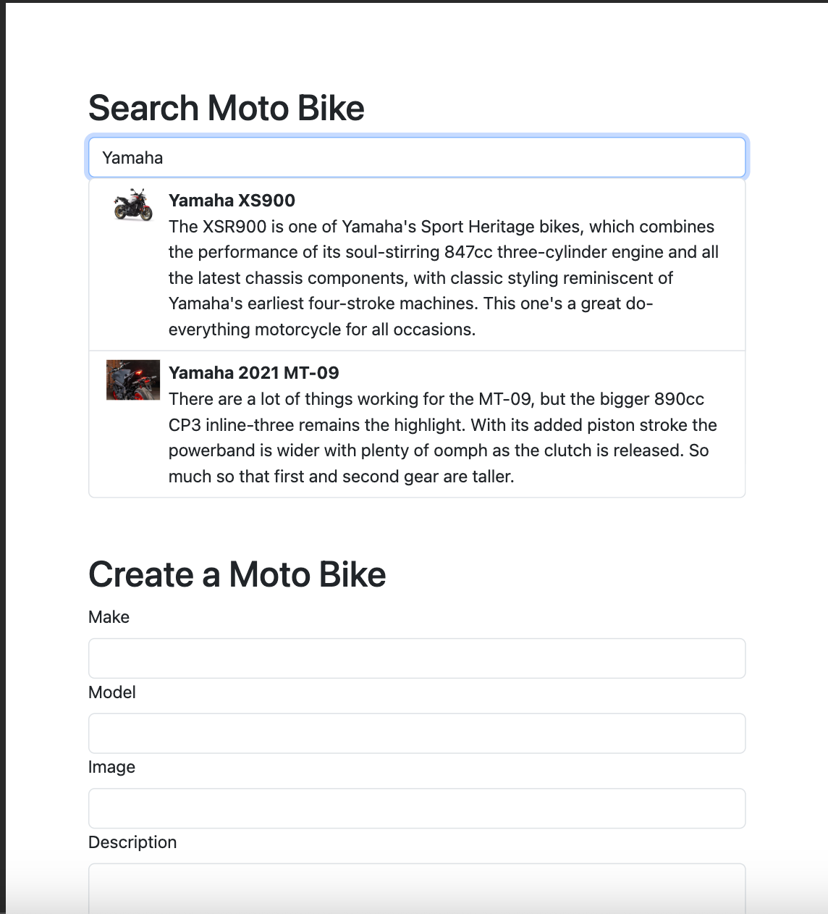

## Overview
This demo app showcases the integration of Redis Full Text Search with a Next.js application, providing a powerful and efficient search functionality.

## Getting Started

First, run the development server:

```bash
npm run dev
# or
yarn dev
```

Open [http://localhost:3000](http://localhost:3000) with your browser to see the result.

